# Аудит исходного journal-site

Дата: 8 сентября 2026. Отчёт составлен до изменений исходного кода. Проверены все 50 файлов из архива: сервер, парсер, API, страницы, компоненты, оба CSS, тесты, настройки и инструкции. `package-lock.json` отсутствовал в архиве, создан при установке зависимостей.

## 1. Как работает проект

Это Next.js App Router + React с серверным чтением Excel. Веб-сайт и Telegram-бот показывают групповой журнал. Страница `/` выбирает группу; `/group/[id]` показывает табели и предметные таблицы. Записи об оценках не редактируются. Пользователь подтвердил общий просмотр внутри своей группы.

## 2. Как работает parser

`lib/yandex-disk.ts` получает Excel через официальный REST API Яндекс.Диска. Основной режим `yandex-public-cache`: список ссылок задаётся оператором в `YANDEX_DISK_PUBLIC_URLS`; публичная папка разворачивается в файлы. Также есть `local`, `yandex-public`, `yandex-private` (серверный OAuth).

Это НЕ HTML scraping. Нет DOM, cookies исходного журнала, браузерного запроса к колледжу или авторизации студента в колледже. Нет пользовательской формы подключения URL. Ссылка относится к файлу всей группы, а не к идентификатору студента.

`lib/parseJournal.ts` использует SheetJS. Предмет определяется по листу и C1/A1, преподаватель — C2/A2; номера и имена студентов — столбцы A/B; месяцы и дни — строки 3/4. Объединения Excel `!merges` поддерживаются. Итоговые колонки исключаются по словам. Темы читаются после заголовка «Дата / Тема». Лист «Табели» читается отдельно; поддержаны простые межлистовые ссылки и CONCATENATE. Полного вычислителя Excel-формул нет.

## 3. Data Flow

```mermaid
flowchart LR
  A[Excel колледжа на Яндекс.Диске] --> B[URL из env]
  B --> C[REST metadata и download href]
  C --> D[Скачивание Buffer сервером]
  D --> E[Файлы .journal-cache + latest.json]
  E --> F[SheetJS parseJournal]
  F --> G[JournalData: предметы, студенты, табели]
  G --> H[Map распарсенных журналов в памяти]
  H --> I[Server Components и API]
  I --> J[Dashboard и Telegram]
```

В исходной реализации запись файла в основной дисковый кэш предшествует проверке парсером — это критический дефект порядка операций.

## 4. Какие данные доступны

Из поддерживаемого шаблона: группа; ФИО и порядковые номера; листы/названия дисциплин; преподаватели; непустые отметки с буквой колонки и текстовыми месяцем/днём; вычисляемые средние; точные `н` и `н/у`; темы, текст дополнительных заданий; сессия/итоговые значения и подписи из «Табелей».

В репозитории нет настоящего Excel-файла, только генераторы синтетических fixtures. Соответствие актуальному файлу колледжа нельзя подтвердить по архиву. Примеры ссылок из документации не использовались для выгрузки персональных данных. Нет подтверждённого расписания пар, времени, кабинетов, семестра, постоянных ID студента/занятия или процента посещаемости. Такие сведения нельзя выдумывать.

## 5. Даты

Дата сейчас не является нормализованным полем: сохраняются только строки monthLabel/dayLabel/label. Год и учебный период не извлекаются. Date форматируется через локальный часовой пояс процесса. Дополнительная служебная колонка может стать «занятием». Пустые отметки отбрасываются; frontend затем собирает колонки только из оставшихся отметок, поэтому день без оценок у всей группы исчезает. Несколько занятий в один день различаются буквой колонки, но постоянного lesson ID нет. Привязка тем к колонкам в UI не работает надёжно из-за разных правил удаления точек.

Нужно сохранять исходный текст, отдельно нормализовать календарную дату без времени, брать год только из явного источника/настройки, проверять календарную корректность, сохранять все распознанные занятия и их повторения.

## 6. Обновление

Есть таймер, стартовый прогрев и обновление по истечении интервала при чтении. По умолчанию 30 минут, в render.yaml 5 минут; окно 05–24, UTC+5. Скачивания одной группы объединяются через Promise. При сетевом сбое возвращается прошлый файл.

Но повреждённый успешно скачанный файл уже заменяет latest до парсинга. При ошибке парсинга отката нет. Парсированный Map ключуется путём/именем, не содержимым: local/private/public могут навсегда показывать старую версию. `updatedAt` обозначает время парсинга, не загрузки. UI его вообще не показывает и не умеет обновляться без перезагрузки. Нет backoff после ошибки. Метаданные записываются неатомарно, старые версии удаляются до фиксации новых метаданных.

## 7. Что хранится

БД отсутствует. `.journal-cache`: Excel, `latest.json`, `groups.json`; ограниченное число копий на группу. В памяти: распарсированные JournalData, выполняющиеся Promise и таймер. Cookie: постоянный SHA-256 от общего кода. localStorage: только тема. Персональных аккаунтов/привязок студента/журнала уведомлений нет.

## 8. Source of truth и продуктовая модель

Учебные значения принадлежат исходному Excel колледжа. Файлы и Map — заменяемые копии, не вторая система оценок. Приложение создаёт представление, вычисляемую статистику и тему. Средние по отметкам и официальные итоговые значения листа «Табели» могут различаться; необходимо явно указывать происхождение. Идентификация посетителя сейчас — один необязательный код на весь сайт, без ограничения групп. По согласованной модели нужны отдельные групповые коды с серверной проверкой области доступа.

## 9. Проблемы по приоритетам

### Critical

- Переключение на непроверенный файл и удаление рабочих копий (`lib/yandex-disk.ts:839–873`), в том числе HTML login/ошибки с HTTP 200.
- Telegram setup изменяет webhook через открытый GET и доверяет forwarded host/proto (`app/api/telegram/setup/route.ts`); весь префикс исключён из middleware. Webhook secret необязателен, пользователи/чаты не ограничены. Общий код сайта не защищает бот.
- Утечка ссылок/путей через RSC: `app/page.tsx` передаёт целый JournalGroupRef в client component, включая filePath/sourceDetails. Идентификатор-хэш не предотвращает сериализацию этих полей.

### High

- Бессрочно устаревший parsed cache для стабильных путей (`lib/journal.ts:39–63`).
- Парсер молча пропускает лист без «средний» в строках 3/4 и допускает 0 предметов. Максимальный по размеру список студентов теряет людей с других листов; однофамильцы с одинаковым ФИО перезаписываются. Резервное сопоставление по row5+index может приписать чужие оценки.
- Год/дата не нормализованы; исчезают пустые занятия. Цвета и статистика расходятся для `НУ`, латиницы, нескольких оценок и дробных строк.
- Нет групповой авторизации; открытый по умолчанию сайт отдаёт ФИО/оценки всех групп. Статический cookie не имеет серверного срока действия; вход не ограничен по частоте; нет logout. `next=/\\host` обходит защиту редиректа.
- Fetch без timeout/лимита размера; href и редиректы не ограничены доверенными хостами. Прямой публичной SSRF-точки для произвольного URL не обнаружено: ID группы сверяется с настроенным списком. Нужна защита пути скачивания от недоверенного href/redirect/DNS.
- Старый SheetJS 0.18.5 и Next 16.2.3 требуют обновлений безопасности. Применимость конкретных Next CVE зависит от используемых функций; факт эксплуатации не установлен.

### Medium

- Ошибки API/страниц/бота и логи включают полные URL, пути и внешние сообщения.
- «Табели» частично заполненного листа исключают студентов без отдельного блока; синтетические строки добавляются без указания происхождения. Общая статистика и табель показывают разные средние без пояснения.
- Group ID зависит от имени файла/label внутри виртуального пути и меняется при переименовании; пагинация папок ограничена первой страницей.
- Отсутствуют refresh/stale UX; восстановление/прогрев делают лишние запросы; HTML 200/пустая структура не классифицируются.
- На телефоне остаётся широкая таблица с большими фиксированными столбцами; значимые подписи мелкие. Темы и оценки не связаны нормализованной датой.

### Low

- Жёстко заданная ссылка на чужой по отношению к конкретной установке бот; примеры реальных ссылок в шаблоне и render.yaml.
- Дублирующиеся стили и противоречия инструкций: README обещает готовый `.env.local`, которого нет; Node и интервалы различаются; lockfile намеренно отключён в Render.
- Начальный скрипт темы экспортируется из client module и импортируется серверным layout; проверка SSR нужна. Telegram SDK загружается и вне Telegram, подписка не очищается.

## 10. Что уже хорошо

Серверная граница SheetJS, типизированная JournalData, отсутствие записи оценок, поддержка нескольких источников и Excel merges, обход всех месячных блоков после промежуточных итогов, ограниченное хранение версий, объединение параллельных скачиваний, проверка legacy ID по списку групп, экранирование Telegram HTML, темы, поиск/сортировка, существующие локальные тесты. Это следует сохранять.

## 11. Что доработать

Проверка файла до публикации кэша; атомарная фиксация/восстановление; честная свежесть; ограниченные запросы и backoff; кэш по содержимому; нормализованные даты/занятия; единая трактовка отметок; безопасное сопоставление студентов; классы ошибок; серверная изоляция групп; защищённый бот; DTO без внутренних ссылок; доступный refresh и мобильное представление. Обновить зависимости и запуск с воспроизводимым lockfile.

## 12. Что можно добавить честно

Просмотр отметок по датам, поиск и фильтр студента/предмета, карточки занятий на телефоне, последние отметки, количество распознанных оценок, подсказка методики среднего, сравнение двух проверенных snapshots (добавлена/изменена/удалена отметка). Год неизвестен — отображать это явно. Расписание и процент посещаемости без исходных данных не добавлять.

## 13. План изменений

1. Зафиксировать этот аудит и исходную копию.
2. Укрепить модель дат/отметок/идентичности и валидацию XLSX, сохранив шаблонный адаптер.
3. Исправить скачивание, атомарный cache, fallback, срок актуальности и ошибки.
4. Ограничить доступ группами, закрыть Telegram setup/webhook и утечки, исправить login/logout.
5. Добавить обновление без обнуления экрана, время sync, просмотр по датам/мобильные карточки и честное происхождение статистики.
6. Fixture/regression tests: даты, пустые клетки, повторные занятия, сдвиги шапки, повреждённый файл/login, новая/исправленная/удалённая оценка, сбои и параллельные запросы; HTTP/UI сценарии с синтетическими данными.
7. Typecheck, lint, tests, production build, desktop/mobile/direct URL/console. Сохранить исправленный проект, отчёт об изменениях и точные ограничения проверки.

## Внешние первичные источники

- [SheetJS: установка и официальный пакет](https://docs.sheetjs.com/docs/getting-started/installation/nodejs/).
- [SheetJS: CVE-2023-30533](https://cdn.sheetjs.com/advisories/CVE-2023-30533).
- [Next.js: August 2026 Security Release](https://nextjs.org/blog/august-2026-security-release).

Ограничение: HTML fixtures не подменяют XLSX parser. Тестовые сценарии создаются в фактическом формате Excel. Производственное подключение/Telegram отправка не выполнялись.
